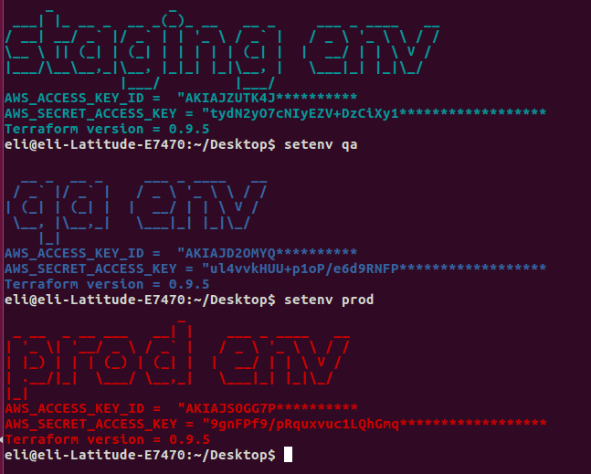

# EnvChange


Replacing the environment vars between the inneractive, ia-staging, ia-dev, ia-qa env.

 

1) Copy this 2 files into your home directory:  cred.json , *********** .

2) Open the file and change the XXXXX with your true AWS keys. 

3) Inside your ~/.bashrc file add this code at the end of the file:

alias setenv='source ~/setenv.sh staging'


Usage:

```./setenv ENVIROMENT```
```./setenv prod / staging / qa```





